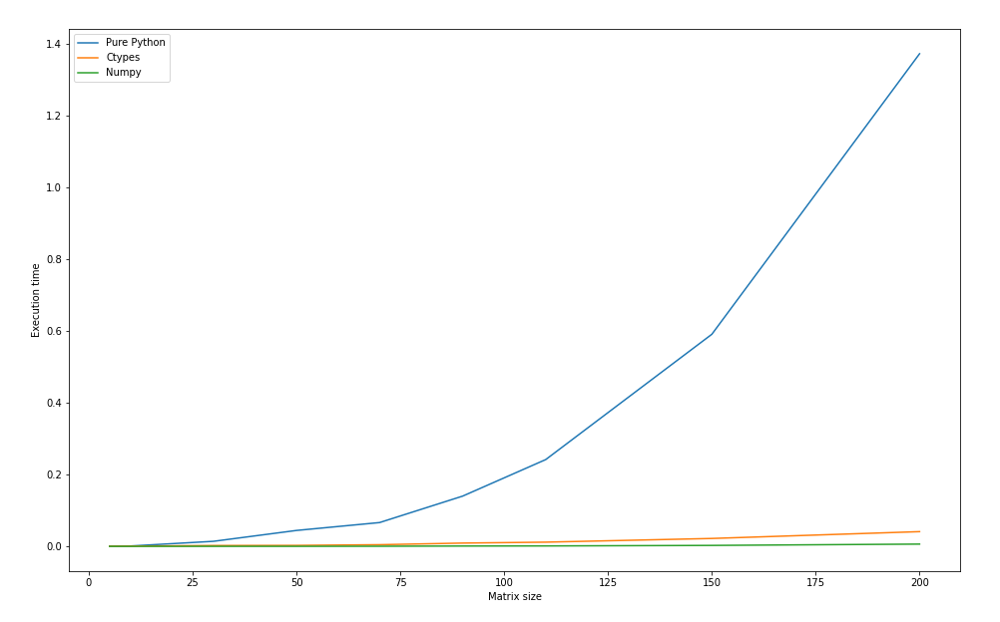

# Third Homework Report


## Overview
In this homework I've implemented some matrix operations using Python, Numpy and C++ with Python ctypes library. 
After that I've measured time it took for the programs to run.

## Measurements Table

```

     Pure Python    Ctypes     Numpy
5       0.000198  0.000591  0.000129
10      0.001059  0.000794  0.000125
30      0.014069  0.002360  0.000168
50      0.044353  0.002713  0.000188
70      0.066294  0.004671  0.000372
90      0.139928  0.009154  0.000961
110     0.241682  0.011749  0.001231
150     0.590638  0.022036  0.002671
200     1.371608  0.041037  0.006343
```

Execution time for different for matrices with different size parameter.

## Plots



1) Comparison of all implementations.


2) Python Numpy vs Python ctypes implementations.

## Conclusions

The result clearly suggests that `numpy` implementation is the fastest one here. It was not a surprise for me to see that Python implementation is extremely slow in comparison to other two. However, I should notice here that my C++ implementation doesn't use parallelism techniques and I suppose that it can be improved by utilizing it. Still I guess there is a case where naive C++ implementation could be faster than `numpy` - is when matrix size is relatively small, even thought `numpy` matrix multiplication implementation has `O(N^(2.3))` complexity and naive implementation has `O(N^(3)` complexity, `numpy` has a big constant in its complexity.
